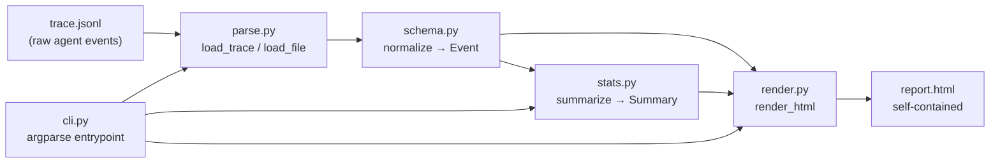

# agent-trace-viewer

Turn raw LLM agent run traces into a readable, shareable HTML report — no API keys, no server, no dependencies.

Point it at a `.jsonl` (or `.json`) trace of an agent run — thoughts, tool calls, observations, errors, final answers — and get a single self-contained HTML file with:

- **Summary cards** — steps, tool calls, errors, tokens in/out, latency, wall time
- **Latency waterfall** — inline SVG chart of per-step latency, slowest steps first-class
- **Tool usage table** — which tools the agent actually called, and how often
- **Step timeline** — every event, collapsible, with args and token counts

## Install

```bash
git clone https://github.com/sulaimanvesal/agent-trace-viewer
cd agent-trace-viewer
pip install -r requirements.txt   # pytest only; the package itself is stdlib-only
```

## Usage

```bash
# Render a report
python -m traceviewer my_run.jsonl -o report.html --title "Friday eval run"

# Or just print the summary to the terminal
python -m traceviewer my_run.jsonl --summary

# Merge several trace files into one report
python -m traceviewer run_a.jsonl run_b.jsonl -o combined.html
```

Open `report.html` in any browser. It works fully offline — all CSS/SVG is inlined.

## Trace format

One JSON object per line. Missing keys are tolerated; unknown event types fall back to `thought`.

```jsonl
{"step": 1, "type": "thought", "content": "I should search for benchmarks."}
{"step": 2, "type": "tool_call", "tool": "web_search", "args": {"query": "vector db benchmark"}, "latency_ms": 1840, "tokens": {"input": 1250, "output": 380}}
{"step": 3, "type": "observation", "tool": "web_search", "content": "Top hits: pgvector, Qdrant, ..."}
{"step": 4, "type": "error", "content": "calculator plugin unavailable"}
{"step": 5, "type": "final_answer", "content": "Recommendation: start with pgvector ..."}
```

Event types: `user`, `thought`, `tool_call`, `observation`, `error`, `final_answer`.
Alternate keys are accepted (`event` for `type`, `tool_name` for `tool`, `arguments` for `args`, `prompt`/`completion` for token counts, `timestamp` for `t`).

## Demo (zero API keys)

```bash
python demo/make_demo.py
```

Generates `demo/sample_trace.jsonl` (a 13-step research-agent run) and renders `demo/report.html`.

## Architecture



- **schema.py** — `Event` dataclass + tolerant `normalize()`; no strict schema required.
- **parse.py** — reads JSONL or JSON, merges multiple files, sorts by step.
- **stats.py** — token totals, latency totals, tool-call histogram, top-5 slowest steps, wall time.
- **render.py** — builds the HTML: summary cards, SVG waterfall, tables, `<details>` timeline. Escapes all event content (XSS-safe reports).
- **cli.py** — `python -m traceviewer` entry point with `--summary` text mode.

## Tests

```bash
pytest -q
```

14 tests cover parsing, normalization, stats aggregation, and rendering (including HTML escaping).

## License

MIT — see [LICENSE](LICENSE).
